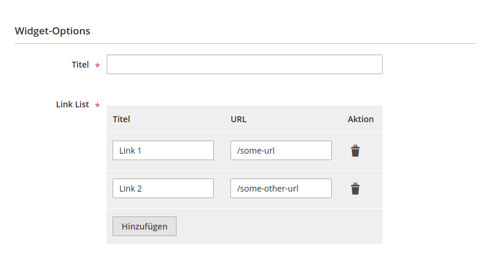

# Magento 2 Dynamic Rows Widget implementation

Simple Implementation to add ability adding dynamic rows in widget context.

## Basic Usage
### Backend
Adding Block to widget-parameter will do the trick:

```xml
[...]
<parameter name="link_list" xsi:type="block" visible="true" required="true" sort_order="10">
    <label translate="true">Link List</label>
    <block class="Wamoco\Shop\DynamicRowsWidget\Adminhtml\DynamicRows"/>
</parameter>
[...]
```
@see `src/etc/widget.xml`



### Output Data
For some reason the de-serialized data are somehow broken. Use or extend `Wamoco\DynamicRowsWidget\Block\Widget\View`-Block to output data.

In template call :
```injectablephp
/** @var \Wamoco\DynamicRowsWidget\Block\Widget\View $block */
$linkList = $block->getLinkObjects('parameter_name');

/** @var \Magento\Framework\DataObject $link */
foreach ($linkList as $link){
    echo '<a href="'.$link->getUrl().'">'.$link->getTitle().'</a>';
}
```

Both methods are based on columns in DynamicRows Field-config:
```injectablephp
\Wamoco\DynamicRowsWidget\Block\Adminhtml\Widget\DynamicRows:_prepareToRender()
[...]
/**
 * Prepare rendering the new field by adding all the needed columns
 */
protected function _prepareToRender()
{
    $this->addColumn('title', [
        'label' => __('Title')
    ]);
    $this->addColumn('url', [
        'label' => __('Url')
    ]);
    $this->_addAfter = false;
    $this->_addButtonLabel = __('Add');
}
[...]
```

## Troubleshooting
Module does currently not work for inline widgets (created within a cms page or block)